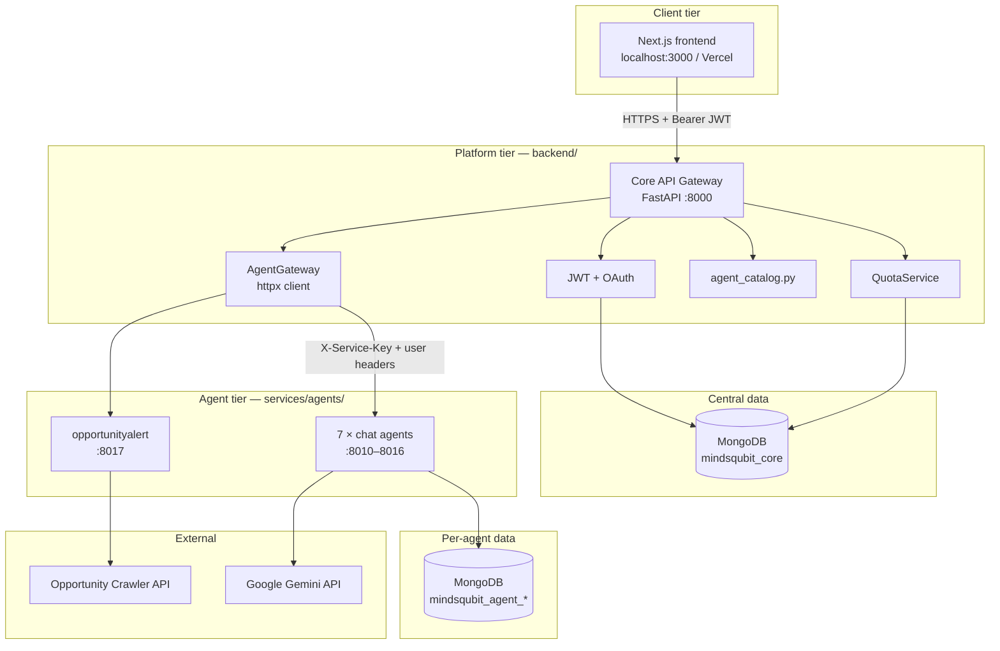
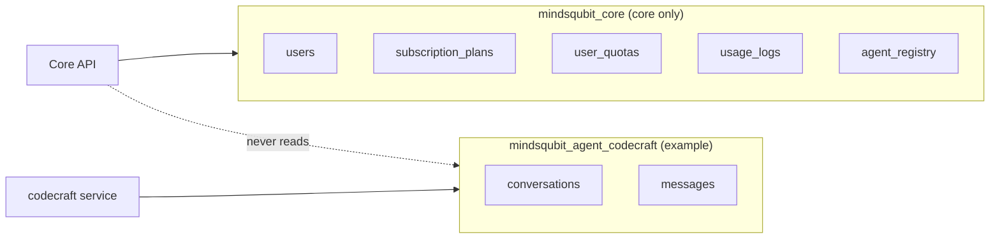
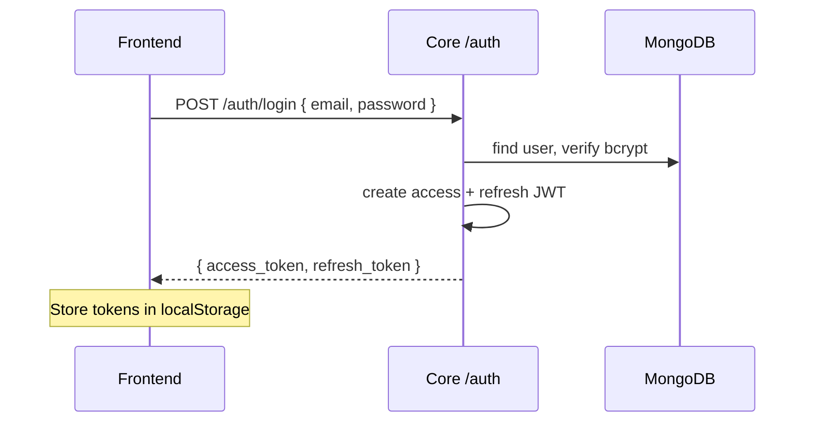
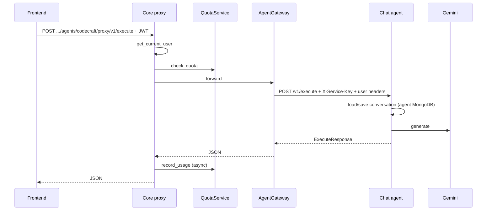
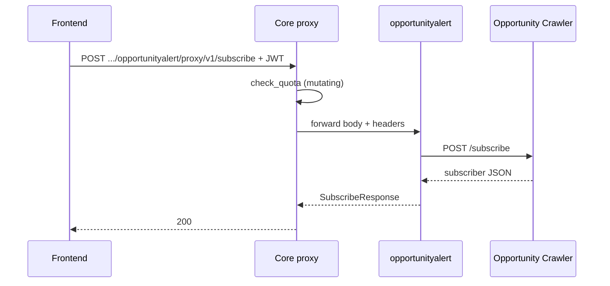

# MindsQubit — System Architecture

> **Purpose of this document:** Explain how the platform is built end-to-end, with **backend depth** suitable for system-design and backend interviews.  
> **Stack:** Next.js · FastAPI (core gateway) · FastAPI agent microservices · MongoDB · Google Gemini · external Opportunity Crawler API.

---

## 1. Elevator pitch (30 seconds)

**MindsQubit** is a multi-agent AI platform. Users authenticate once against a **central API gateway** (`backend/`). The gateway handles **identity, billing plans, and usage quotas**, then **proxies** work to **one microservice per agent**. Chat agents run Gemini and store conversations in **their own MongoDB databases**. Integration agents (e.g. OpportunityAlert) call **external APIs**. The browser only talks to the core API—never directly to agents or third-party services.

**Pattern name:** API Gateway + microservices, with **database-per-service** for chat agents and a **single central database** for platform concerns.

---

## 2. High-level system context



| Layer | Responsibility | Does **not** do |
| ----- | -------------- | ----------------- |
| **Frontend** | UI, token storage, calls `/api/v1/*` on core | Agent logic, Gemini, quota enforcement |
| **Core API** | Auth, quotas, catalog, HTTP proxy to agents | LLM calls, conversation storage, crawler storage |
| **Chat agents** | Execute prompts, conversations, Gemini | User registration, global quotas |
| **Integration agents** | Domain-specific proxy (e.g. email subscribe) | Platform auth (trust core headers) |
| **mindsqubit_core** | Users, plans, quotas, usage logs, agent registry mirror | Chat messages |
| **mindsqubit_agent_*** | Conversations per chat agent | User accounts |

---

## 3. Repository layout

```text
minds_qubit/
├── backend/                         # Core API gateway (interview focus)
│   ├── main.py                      # App factory, lifespan, CORS, index creation
│   ├── api/v1/
│   │   ├── router.py                # Mounts auth, agents, quota
│   │   ├── auth/                    # register, login, refresh, OAuth
│   │   ├── agents/
│   │   │   ├── router.py            # Catalog + proxy sub-routers
│   │   │   ├── catalog/             # Public agent listing
│   │   │   ├── proxy/router.py      # Generic agent proxy (all agents)
│   │   │   └── common.py            # Quota helper, response mapping
│   │   └── quota/                   # GET /quota/me
│   ├── core/
│   │   ├── config.py                # Pydantic Settings from .env
│   │   ├── database.py              # Motor client → mindsqubit_core only
│   │   ├── dependencies.py          # JWT → UserContext, require_quota factory
│   │   └── security.py              # bcrypt, JWT create/decode
│   ├── models/                      # Pydantic shapes for MongoDB documents
│   └── services/
│       ├── agent_catalog.py         # Static agent registry + service URLs
│       ├── agent_gateway.py         # httpx forward to microservices
│       └── quota_service.py         # check_quota + record_usage
├── packages/agent-contract/         # Shared headers + request/response schemas
├── services/agents/
│   ├── _shared/chat_runtime/        # Reusable FastAPI app for chat agents
│   └── opportunityalert/          # Integration agent → crawler
├── frontend/                        # Next.js — core API client only
├── docker-compose.yml               # Full local stack
├── Architecture.md                  # This file
└── Schema.md                        # mindsqubit_core field-level schema
```

---

## 4. Backend architecture (deep dive)

### 4.1 Architectural role: API Gateway (BFF-lite)

The core backend is **not** a monolith that runs AI. It is an **orchestration layer**:

1. **Terminates user trust** — validates JWT, loads `plan_id`.
2. **Enforces product rules** — quotas before mutating agent calls.
3. **Routes by agent id** — resolves `AGENT_<ID>_URL` from config/catalog.
4. **Propagates identity** — forwards `X-User-Id`, `X-User-Email`, `X-Plan-Id` plus `X-Service-Key` to agents.

This keeps agents **simple and independently deployable** (e.g. on Render: one web service per agent).

**Interview line:** *“We separated cross-cutting platform concerns (auth, billing, rate limits) from agent-specific compute (LLM, integrations) so we can scale and deploy agents independently without redeploying the gateway.”*

---

### 4.2 Layered structure inside `backend/`

```text
┌─────────────────────────────────────────────────────────────┐
│  HTTP layer          api/v1/*/router.py                     │
│  (thin controllers)  — parse request, Depends(), return DTO │
├─────────────────────────────────────────────────────────────┤
│  Domain services     services/*.py                            │
│                      auth (in api/v1/auth/service.py)       │
│                      quota_service, agent_gateway, catalog  │
├─────────────────────────────────────────────────────────────┤
│  Infrastructure      core/config, database, security          │
│                      dependencies (auth + quota DI)         │
├─────────────────────────────────────────────────────────────┤
│  Models              models/*.py (Pydantic ↔ MongoDB shape)  │
└─────────────────────────────────────────────────────────────┘
```

**FastAPI dependency injection** is the glue:

- `get_current_user` → JWT → `UserContext { user_id, email, plan_id }`
- `check_agent_quota` / proxy router → `quota_service.check_quota` before POST/PATCH/PUT
- Routes stay thin; business logic lives in services.

---

### 4.3 Application startup (`main.py` lifespan)

On boot, the core runs a **lifespan** hook (non-fatal if MongoDB is down—server still starts):

| Step | Function | Purpose |
| ---- | -------- | ------- |
| 1 | `db_manager.connect()` | Motor async client, ping MongoDB |
| 2 | `_seed_plans()` | Insert `subscription_plans` if empty (`free`, `pro`, `enterprise`) |
| 3 | `_sync_agents()` | Upsert every entry from `agent_catalog.py` → `agent_registry` collection |
| 4 | `_ensure_indexes()` | Unique `users.email`, compound unique `user_quotas`, `usage_logs` indexes |

**Why sync catalog → MongoDB?**  
Python `agent_catalog.py` is the **source of truth** for listing and routing at runtime. MongoDB `agent_registry` is a **mirror** for admin tools, analytics, or future services that should not import Python modules.

**CORS** is applied at the FastAPI app level (`CORSMiddleware`) using `CORS_ORIGINS` from `.env` — only relevant for **browser → core** calls.

---

### 4.4 API surface (`/api/v1`)

Mounted in `api/v1/router.py`:

| Module | Prefix | Auth | Description |
| ------ | ------ | ---- | ----------- |
| `auth` | `/api/v1/auth` | Mixed | Register, login, refresh, `/me`, OAuth redirects |
| `agents` | `/api/v1/agents` | Mixed | Catalog (public) + proxy (protected) |
| `quota` | `/api/v1/quota` | Protected | `GET /me` — usage dashboard |

#### Agents — catalog (public)

| Method | Path | Notes |
| ------ | ---- | ----- |
| `GET` | `/agents` | All agents; optional `?category=` |
| `GET` | `/agents/categories` | Distinct categories |
| `GET` | `/agents/{agent_id}` | Single agent metadata; exposes `is_live` |

Catalog reads from **in-memory** `services/agent_catalog.py` via `CatalogService` (not a DB round-trip per request).

#### Agents — unified proxy (protected)

| Method | Path | Notes |
| ------ | ---- | ----- |
| `*` | `/agents/{agent_id}/proxy/{path}` | Forwards to `{AGENT_URL}/{path}` |

Examples:

- Chat: `POST /agents/codecraft/proxy/v1/execute` → agent `POST /v1/execute`
- OpportunityAlert: `POST /agents/opportunityalert/proxy/v1/subscribe` → agent `POST /v1/subscribe`

Proxy behavior (`api/v1/agents/proxy/router.py`):

1. Resolve agent from catalog → **404** if unknown.
2. If `is_live == false` → **503** `"Agent is not available yet"`.
3. If method is POST/PATCH/PUT → `check_agent_quota` → **429** if exceeded.
4. `agent_gateway.forward(...)` → agent microservice.
5. On successful **POST**, fire-and-forget `quota_service.record_usage` via `asyncio.create_task` (does not block response).

---

### 4.5 Authentication & authorization

#### User-facing auth (browser → core)

| Mechanism | Implementation |
| --------- | -------------- |
| Password | bcrypt hash in `users` collection |
| Tokens | JWT HS256 — `access` (short) + `refresh` (long) |
| OAuth | Google / GitHub — redirect flow, tokens returned to frontend |
| Protected routes | `Authorization: Bearer <access_token>` |

`get_current_user` (`core/dependencies.py`):

1. Decode JWT; require `type == "access"` and `sub` + `email`.
2. Re-fetch `plan_id` from MongoDB (plan may change after token issuance).

**Interview line:** *“We don’t embed plan limits in the JWT because plan changes should take effect without forcing re-login; only identity is in the token, authorization context is refreshed from DB.”*

#### Service-to-service auth (core → agents)

| Header | Purpose |
| ------ | ------- |
| `X-Service-Key` | Shared secret `AGENT_SERVICE_API_KEY` — proves caller is core |
| `X-User-Id` | Authenticated user |
| `X-User-Email` | User email |
| `X-Plan-Id` | Billing tier (`free`, `pro`, …) |

Defined in `packages/agent-contract/src/agent_contract/headers.py`.  
Each agent validates the service key and requires `X-User-Id` before executing.

**Trust model:** Agents **do not** validate end-user JWTs. They trust the gateway. This avoids distributing `JWT_SECRET_KEY` to N services.

---

### 4.6 AgentGateway — the heart of routing

`services/agent_gateway.py`:

```text
forward(agent_id, method, path, user_id, email, plan_id, json_body, query_params)
    → lookup AgentDefinition.service_url from catalog
    → build URL: {service_url}/{normalized_path}
    → httpx.AsyncClient.request with service + user headers
    → map errors to HTTPException
```

| Failure | HTTP | Detail |
| ------- | ---- | ------ |
| Agent id not in catalog | — | `ValueError` (handled upstream) |
| `service_url` empty | 503 | `service URL is not configured` |
| Connection refused / timeout / DNS | 503 | `Agent service '{id}' is unavailable` |
| Agent returns 4xx | same code | Pass through `detail` from agent body |
| Agent returns 5xx | 503 | Normalized gateway response |

**Production pitfall:** Deploying only core on Render with `AGENT_OPPORTUNITYALERT_URL=http://localhost:8017` causes **503 unavailable** — nothing listens on localhost inside the core container. Each agent needs its own deployed URL in core env.

---

### 4.7 Quota system — design for interviews

**Goal:** Limit agent usage per user per billing plan, without coupling agents to billing logic.

**Collections** (central DB only):

| Collection | Role |
| ---------- | ---- |
| `subscription_plans` | `global_daily_limit`, `global_monthly_limit`, optional `agent_overrides` |
| `user_quotas` | Rolling counters keyed by `(user_id, agent_id, period, period_key)` |
| `usage_logs` | Append-only audit trail per request |

**Limit resolution** (`quota_service._resolve_limits`) — **highest priority wins:**

1. Plan’s `agent_overrides[agent_id]`
2. Agent’s `quota_config` in `agent_catalog.py` (e.g. `pro_daily_limit`)
3. Plan `global_daily_limit` / `global_monthly_limit`

**Concurrency:** Counters use MongoDB `$inc` + `upsert` on a **unique compound index** — safe under parallel requests.

**Latency:** `record_usage` runs in a background task after the proxy returns — logging failures never break user responses.

**Interview questions you can answer:**

- *Why check quota in gateway, not in agents?* Single enforcement point; agents stay dumb; consistent 429 shape for frontend.
- *Why daily and monthly keys?* Cheap rolling windows without cron; `period_key` is `YYYY-MM-DD` or `YYYY-MM`.
- *How would you add Redis?* Cache `subscription_plans` in `_get_plan`; quota counters could move to Redis — service interface unchanged.

---

### 4.8 Data ownership boundaries



**Principle:** Core is the **system of record for identity and billing**. Agents are **system of record for their domain data** (chats, or delegated external storage for integrations).

OpportunityAlert subscriptions live in the **external Opportunity Crawler** — not in core MongoDB.

Field-level central schema: [Schema.md](./Schema.md).

---

### 4.9 Configuration (`core/config.py`)

Pydantic `Settings` loads `backend/.env`:

| Variable | Used by |
| -------- | ------- |
| `MONGODB_URL`, `CENTRAL_DB_NAME` | `DatabaseManager` |
| `JWT_SECRET_KEY`, `JWT_*_EXPIRE_*` | `core/security.py` |
| `AGENT_SERVICE_API_KEY` | `AgentGateway` → all agents |
| `AGENT_<ID>_URL` | Per-agent routing (e.g. `AGENT_CODECRAFT_URL`) |
| `CORS_ORIGINS` | Browser origins allowed to call core |
| `GOOGLE_*`, `GITHUB_*`, `OAUTH_REDIRECT_URL` | OAuth |
| `DEFAULT_PLAN_ID` | New user registration |

**Not in core:** `GEMINI_API_KEY`, `OPPORTUNITY_CRAWLER_URL` — those belong on agent services.

---

## 5. Agent microservices

### 5.1 Two agent types

| Type | Examples | Endpoints | Data |
| ---- | -------- | --------- | ---- |
| **chat** | codecraft, dataviz, … | `POST /v1/execute`, `GET /v1/conversations` | Own MongoDB + Gemini |
| **integration** | opportunityalert | `POST/PATCH /v1/subscribe`, `POST /v1/unsubscribe` | External crawler API |

### 5.2 Chat agent runtime (`_shared/chat_runtime`)

Each chat agent is a thin `main.py` that calls `create_chat_app(ChatAgentConfig(...))`.

Shared runtime provides:

- Service key + user header validation
- `ChatExecutor` — load history, call Gemini, persist messages
- Per-agent DB: `mindsqubit_agent_{agent_id}`

### 5.3 OpportunityAlert (integration)

```text
Frontend
  → POST /api/v1/agents/opportunityalert/proxy/v1/subscribe  (core)
  → POST /v1/subscribe  (opportunityalert :8017)
  → POST /subscribe  (Opportunity Crawler external API)
```

`opportunityalert` validates categories/types, then httpx-forwards to `OPPORTUNITY_CRAWLER_URL`.  
**No CORS on crawler for this app** — browser never calls it directly.

### 5.4 Agent catalog (static registry)

`services/agent_catalog.py` — `AgentDefinition` dataclass per agent:

- Metadata: name, description, icon, category, features
- `agent_type`: `chat` | `integration`
- `service_url`: from `settings.AGENT_*_URL`
- `is_live`: gates proxy (only `opportunityalert` is `true` today for production UX)
- `quota_config`: per-plan default limits

| Agent id | Type | Local port |
| -------- | ---- | ---------- |
| codecraft | chat | 8010 |
| dataviz | chat | 8011 |
| contentcreator | chat | 8012 |
| designmaster | chat | 8013 |
| languagetutor | chat | 8014 |
| researchpro | chat | 8015 |
| techblog | chat | 8016 |
| opportunityalert | integration | 8017 |

---

## 6. End-to-end request flows

### 6.1 Login



### 6.2 Chat execution (when agent is live)



### 6.3 OpportunityAlert subscribe



---

## 7. Frontend coupling (brief)

- **Single backend URL:** `NEXT_PUBLIC_API_BASE_URL` → core only.
- **Axios** (`frontend/src/network/core/axiosInstance.js`): attaches Bearer token; refreshes on 401.
- **Agent actions:** `agentService.proxyAgent(agentId, method, path, body)` — no hardcoded per-agent URLs in components.
- **UI types:** `agentUIConfig.tsx` — `chat` vs `subscription` panels per agent id.

The frontend is intentionally **low coupling**: it could be replaced by mobile or CLI clients using the same REST API.

---

## 8. Deployment topology

### Local

```bash
./scripts/start-agent-services.sh   # agents 8010–8017
cd backend && uvicorn main:app --reload
cd frontend && npm run dev
# or: docker compose up
```

### Production (e.g. Render)

| Service | Deploy unit | Critical env |
| ------- | ----------- | ------------ |
| Core | `backend/` Dockerfile | `MONGODB_URL`, `JWT_SECRET_KEY`, `AGENT_*_URL`, `CORS_ORIGINS` |
| Each chat agent | Separate web service | `GEMINI_API_KEY`, `AGENT_SERVICE_API_KEY`, `MONGODB_URL` |
| opportunityalert | `Dockerfile.integration` | `OPPORTUNITY_CRAWLER_URL`, `AGENT_SERVICE_API_KEY` |
| Frontend | Next.js | `NEXT_PUBLIC_API_BASE_URL` → core public URL |

**Rule:** Every `AGENT_<ID>_URL` on core must be a **reachable public URL** of a running agent service—not `localhost`.

---

## 9. HTTP status codes (troubleshooting & interviews)

| Code | Typical cause in MindsQubit |
| ---- | --------------------------- |
| **401** | Missing/invalid JWT on protected route |
| **404** | Unknown `agent_id` or proxy path |
| **429** | Quota exceeded (`QuotaExceededError`) |
| **503** | Agent `is_live: false`; or gateway cannot reach `AGENT_*_URL`; or agent 5xx |
| **CORS error** (browser) | Frontend origin not in core `CORS_ORIGINS` — fix on **core**, not crawler |

---

## 10. Design tradeoffs (good interview talking points)

| Decision | Benefit | Cost |
| -------- | ------- | ---- |
| API Gateway + microservices | Independent deploy/scale per agent | More services to operate; need service discovery via env URLs |
| Gateway validates JWT, agents trust headers | No secret sprawl; simpler agents | Compromised gateway = full trust boundary |
| Static Python catalog + Mongo sync | Fast list endpoint; versioned in git | Two sources unless you later read only from DB |
| Quota in gateway only | One enforcement point | Agents could be called directly if key leaks — mitigate with network policy |
| Async `record_usage` | Lower latency | Slight risk of under-count if process crashes mid-request (usually acceptable) |
| Database-per chat agent | Isolation, independent schema evolution | More DB namespaces to manage |

**Possible improvements:**

- Service mesh or internal DNS instead of public `AGENT_*_URL`s
- Redis cache for plans and hot quota reads
- Idempotency keys on subscribe/execute
- Health aggregation endpoint on core (`/health/agents`) for ops
- OpenTelemetry tracing across gateway → agent → Gemini

---

## 11. Interview cheat sheet — likely questions

| Question | Short answer |
| -------- | ------------ |
| What pattern is the backend? | API Gateway orchestrating microservices |
| Where is auth enforced? | Core: JWT on user routes; `X-Service-Key` on agent routes |
| Where are conversations stored? | Each chat agent’s MongoDB, not core |
| How do you add a new agent? | New service + catalog entry + `AGENT_*_URL` + docker/Render deploy + optional frontend UI config |
| How do quotas work? | Check before mutating proxy; `$inc` counters after POST; limits from plan → agent override → globals |
| Why 503 on subscribe in prod? | Core can’t reach `opportunityalert` URL (agent not deployed or wrong env) |
| Why not CORS on Opportunity Crawler? | Browser only calls core; server-side httpx calls crawler |

---

## 12. Related documentation

| Document | Contents |
| -------- | -------- |
| [README.md](./README.md) | Quick start |
| [Schema.md](./Schema.md) | `mindsqubit_core` collections |
| [backend/README.md](./backend/README.md) | Core setup & Render deploy |
| [backend/api/v1/agents/README.md](./backend/api/v1/agents/README.md) | Proxy routing details |
| [services/agents/README.md](./services/agents/README.md) | Agent microservice setup |
| [frontend/API_SETUP.md](./frontend/API_SETUP.md) | Frontend ↔ core contract |
| [packages/agent-contract/](./packages/agent-contract/) | Shared inter-service schemas |

---

## 13. Running locally (reference)

```bash
# Terminal 1 — agents (needs GEMINI_API_KEY for chat)
export GEMINI_API_KEY=your_key
export AGENT_SERVICE_API_KEY=dev_agent_service_key
./scripts/start-agent-services.sh

# Terminal 2 — core
cd backend && source .venv/bin/activate && uvicorn main:app --reload

# Terminal 3 — frontend
cd frontend && npm run dev
```

Or from repo root: `docker compose up` (set `GEMINI_API_KEY` in environment).
