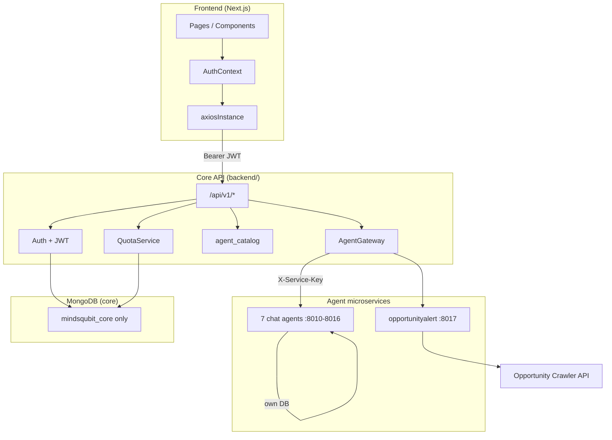
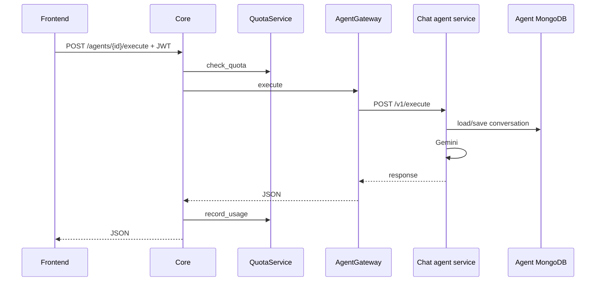

# MindsQubit — System Architecture

MindsQubit is a multi-agent AI platform built as an **API gateway + microservices**:

- **Frontend** (Next.js) — UI only; calls the core API
- **Core** (`backend/`) — auth, quotas, agent catalog, routes HTTP to agent services
- **Agent services** (`services/agents/`) — one deployable service per agent
- **MongoDB** — central DB in core; per-agent chat DBs inside chat microservices
- **Opportunity Crawler** (external) — email subscription source of truth for OpportunityAlert

---

## Repository layout

```text
minds_qubit/
├── backend/                    # Core API gateway
│   ├── api/v1/                 # auth, agents, quota routes
│   ├── core/                   # config, database (central only), security
│   ├── models/                 # Pydantic shapes for central DB
│   └── services/
│       ├── agent_catalog.py    # Agent metadata + service URLs
│       └── agent_gateway.py    # HTTP client to agent microservices
├── packages/agent-contract/    # Shared request/response schemas
├── services/agents/
│   ├── _shared/chat_runtime/   # Shared FastAPI + Gemini + conversations
│   ├── _template/              # Copy to add a new chat agent
│   ├── codecraft/ … techblog/  # 7 chat agent entrypoints
│   └── opportunityalert/       # Integration agent → Opportunity Crawler
├── frontend/                   # Next.js app
├── docker-compose.yml          # MongoDB + core + all agents
├── Architecture.md
└── Schema.md
```

---

## High-level overview



| Layer | Role |
| ----- | ---- |
| **Frontend** | Login, agent listing, chat UI, OpportunityAlert subscription UI |
| **Core API** | JWT validation, quota, agent registry sync, proxy to agents |
| **Central DB** | Users, plans, quotas, usage logs, `agent_registry` |
| **Chat agent services** | Gemini + conversations in **their own** MongoDB (not accessed by core) |
| **OpportunityAlert** | Proxies subscribe/update/unsubscribe to crawler |
| **Opportunity Crawler** | Stores subscriber emails and preferences (external) |

---

## Authentication & login

Authentication is **JWT-based**. Passwords use **bcrypt**; tokens use **HS256** and `JWT_SECRET_KEY`.

| Method | Flow |
| ------ | ---- |
| Email + password | `POST /api/v1/auth/register` or `login` |
| Google / GitHub OAuth | `/api/v1/auth/oauth/{provider}` → callback → tokens in redirect URL |

Protected routes send `Authorization: Bearer <access_token>`.  
`get_current_user` returns `UserContext`: `{ user_id, email, plan_id }`.

See `backend/core/dependencies.py` and `frontend/src/contexts/AuthContext.tsx`.

---

## Databases

The **core API connects to one MongoDB database only:** `mindsqubit_core`.

Access: `db_manager.central` in `backend/core/database.py`.

| Collection | Purpose |
| ---------- | ------- |
| `users` | Accounts, `plan_id`, OAuth links |
| `subscription_plans` | `free` / `pro` / `enterprise` limits |
| `user_quotas` | Per user + agent + period counters |
| `usage_logs` | Append-only audit trail |
| `agent_registry` | Agent metadata synced from `agent_catalog` on startup |

Core does **not** read or write `mindsqubit_agent_*` databases. Conversation history is stored by each chat microservice in its own DB. OpportunityAlert subscriptions are stored in the [Opportunity Crawler](https://opportunity-crawler.onrender.com/docs) API.

Full field-level schema for `mindsqubit_core`: [Schema.md](./Schema.md).

---

## Agent microservices

### Standard internal contract

Documented in `packages/agent-contract/`. Core calls agents with headers:

- `X-Service-Key` — `AGENT_SERVICE_API_KEY`
- `X-User-Id`, `X-User-Email`, `X-Plan-Id` — from JWT

| Endpoint | Chat agents | OpportunityAlert |
| -------- | ----------- | ---------------- |
| `GET /health` | yes | yes |
| `POST /v1/execute` | yes | no |
| `GET /v1/conversations?user_id=` | yes | no |
| `POST /v1/subscribe` | no | yes |
| `PATCH /v1/subscribe` | no | yes |
| `POST /v1/unsubscribe` | no | yes |

### Agent catalog

Static definitions in `backend/services/agent_catalog.py`, synced to MongoDB `agent_registry` on core startup (`backend/main.py`).

| Agent id | Type | Port (local) |
| -------- | ---- | ------------ |
| codecraft | chat | 8010 |
| dataviz | chat | 8011 |
| contentcreator | chat | 8012 |
| designmaster | chat | 8013 |
| languagetutor | chat | 8014 |
| researchpro | chat | 8015 |
| techblog | chat | 8016 |
| opportunityalert | integration | 8017 |

### Execution flow (chat)



### OpportunityAlert flow

Frontend → core (`/api/v1/agents/opportunityalert/subscribe`) → opportunityalert service → Opportunity Crawler `POST /subscribe`.

Frontend uses `uiType: 'subscription'` in `agentUIConfig.tsx` (not the chat UI).

---

## Subscriptions & quotas

- **Billing plan** on user (`plan_id`) in central DB
- **Usage limits** enforced per `(user_id, agent_id)` via `user_quotas`
- Limit resolution: plan `agent_overrides` → agent `quota_config` → plan globals
- Over limit → **HTTP 429**

`GET /api/v1/quota/me` — current usage for dashboard.

---

## API surface (v1)

| Prefix | Purpose |
| ------ | ------- |
| `/api/v1/auth` | Register, login, refresh, me, OAuth |
| `/api/v1/agents` | List agents, execute, conversations |
| `/api/v1/agents/opportunityalert/subscribe` | Email subscribe (auth + quota) |
| `/api/v1/agents/opportunityalert/subscribe` (PATCH) | Update preferences |
| `/api/v1/agents/opportunityalert/unsubscribe` | Unsubscribe |
| `/api/v1/quota` | Usage / limits |

Public: list agents, categories, agent details.  
Protected: execute, conversations, subscribe endpoints, quota/me, auth/me.

---

## Configuration

### Core (`backend/.env`)

| Variable | Purpose |
| -------- | ------- |
| `MONGODB_URL` | MongoDB cluster (core uses `CENTRAL_DB_NAME` only) |
| `CENTRAL_DB_NAME` | Default `mindsqubit_core` — **only DB the core opens** |
| `JWT_SECRET_KEY` | Token signing |
| `AGENT_SERVICE_API_KEY` | Shared secret to agent services |
| `AGENT_<ID>_URL` | Base URL per agent service |
| `CORS_ORIGINS` | Frontend origins |
| `OAUTH_*` | OAuth client credentials |

Gemini keys are **not** in core — set `GEMINI_API_KEY` on each chat agent service.

### Chat agent service

| Variable | Purpose |
| -------- | ------- |
| `AGENT_ID` | e.g. `codecraft` |
| `MONGODB_URL` | Same cluster; service uses `mindsqubit_agent_<id>` |
| `AGENT_DB_PREFIX` | Default `mindsqubit_agent_` (agent service only) |
| `GEMINI_API_KEY` | Google Gemini |
| `AGENT_SERVICE_API_KEY` | Must match core |

### Frontend

| Variable | Purpose |
| -------- | ------- |
| `NEXT_PUBLIC_API_BASE_URL` | Core API URL |

---

## Running locally

```bash
# Terminal 1 — agents (needs GEMINI_API_KEY)
export GEMINI_API_KEY=your_key
./scripts/start-agent-services.sh

# Terminal 2 — core
cd backend && source .venv/bin/activate && uvicorn main:app --reload

# Terminal 3 — frontend
cd frontend && npm run dev
```

Or: `docker compose up` from repo root (set `GEMINI_API_KEY` in environment).

---

## Adding a new agent

**Chat agent**

1. Copy `services/agents/codecraft/` or use `_template/`
2. Add config in `chat_runtime/configs.py` (or inline)
3. Register in `backend/services/agent_catalog.py` + `AGENT_<ID>_URL` in core `.env`
4. Add service to `docker-compose.yml` and `scripts/start-agent-services.sh`
5. Add `agentUIConfig` entry in frontend

**Integration agent**

1. New FastAPI service with custom `/v1/*` routes
2. Register in catalog with `agent_type: integration`
3. Add proxy routes on core (see OpportunityAlert in `api/v1/agents/router.py`)
4. Custom frontend UI if not chat-based

---

## Modularity checklist

| Concern | Modular? | Where |
| ------- | -------- | ----- |
| New chat agent | Yes | New service + `agent_catalog` + env URL |
| New integration agent | Yes | New service + core proxy routes + UI |
| Auth / billing | Yes | Core only |
| Conversation storage | Yes | Per chat service (not in core) |
| Core database | Yes | Single DB: `mindsqubit_core` |
| Frontend | Low coupling | Core REST API only |

## Related docs

- [README.md](./README.md) — quick start
- [Schema.md](./Schema.md) — `mindsqubit_core` schema
- [backend/README.md](./backend/README.md) — core setup
- [services/agents/README.md](./services/agents/README.md) — agent microservices
- [frontend/README.md](./frontend/README.md) — UI
- [frontend/API_SETUP.md](./frontend/API_SETUP.md) — frontend ↔ core API
