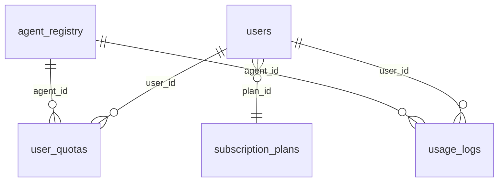

# MindsQubit — Database Schema (Core)

This document describes the **only MongoDB database accessed by the core API** (`backend/`): **`mindsqubit_core`**.

The core gateway does **not** connect to `mindsqubit_agent_*` databases. Chat history and other agent-local data live inside agent microservices (`services/agents/`). Email subscriptions for OpportunityAlert live in the external [Opportunity Crawler](https://opportunity-crawler.onrender.com) API.

For system design, see [Architecture.md](./Architecture.md).

---

## Topology

```text
MongoDB cluster (MONGODB_URL)
└── mindsqubit_core                    ← db_manager.central (core only)
    ├── users
    ├── subscription_plans
    ├── user_quotas
    ├── usage_logs
    └── agent_registry
```

| Setting | Env variable | Default |
| ------- | ------------ | ------- |
| Connection | `MONGODB_URL` | `mongodb://localhost:27017` |
| Database name | `CENTRAL_DB_NAME` | `mindsqubit_core` |

**Code access:** `db_manager.central` in `backend/core/database.py`.

---

## Shared types

| Type | Description |
| ---- | ----------- |
| `ObjectId` | MongoDB `_id` (except string `_id` on `subscription_plans`) |
| `PyObjectId` | Pydantic bridge — `backend/models/shared.py` |
| Timestamps | UTC `datetime` |

---

## Collection: `users`

**Model:** `UserInDB` — `backend/models/user.py`  
**Purpose:** Accounts (email/password and OAuth).

| Field | Type | Required | Notes |
| ----- | ---- | -------- | ----- |
| `_id` | ObjectId | yes | Auto-generated |
| `email` | string (email) | yes | **Unique index** |
| `full_name` | string | no | Display name |
| `hashed_password` | string | yes | bcrypt; `""` for OAuth-only |
| `oauth_providers` | object | no | e.g. `{ "google": "sub" }` |
| `plan_id` | string | yes | `free` \| `pro` \| `enterprise` |
| `is_active` | boolean | yes | Default `true` |
| `created_at` | datetime | yes | |
| `updated_at` | datetime | yes | |

**Index:** `email` (unique)

---

## Collection: `subscription_plans`

**Model:** `SubscriptionPlan` — `backend/models/quota.py`  
**Purpose:** Plan limits. Seeded from `DEFAULT_PLANS` if empty on startup.

| Field | Type | Notes |
| ----- | ---- | ----- |
| `_id` | string | `free`, `pro`, `enterprise` |
| `name` | string | Display name |
| `price_monthly_usd` | number | |
| `global_daily_limit` | int | Default daily cap per agent |
| `global_monthly_limit` | int | |
| `agent_overrides` | object | Optional per-agent limits |
| `is_active` | boolean | |

| Plan | Daily | Monthly | USD/mo |
| ---- | ----- | ------- | ------ |
| free | 30 | 200 | 0 |
| pro | 300 | 5,000 | 9 |
| enterprise | 9,999 | 99,999 | 49 |

---

## Collection: `user_quotas`

**Model:** `UserQuota` — `backend/models/quota.py`  
**Purpose:** Rolling usage counters per user, agent, and period.

| Field | Type | Notes |
| ----- | ---- | ----- |
| `_id` | ObjectId | Auto on upsert |
| `user_id` | string | User `_id` as string |
| `agent_id` | string | e.g. `codecraft` |
| `period` | string | `daily` \| `monthly` |
| `period_key` | string | `YYYY-MM-DD` or `YYYY-MM` |
| `request_count` | int | Incremented with `$inc` |
| `token_count` | int | Reserved |
| `last_request_at` | datetime | |

**Index:** unique `(user_id, agent_id, period, period_key)`

---

## Collection: `usage_logs`

**Model:** `UsageLog` — `backend/models/quota.py`  
**Purpose:** Append-only audit trail (never updated after insert).

| Field | Type | Notes |
| ----- | ---- | ----- |
| `_id` | ObjectId | |
| `user_id` | string | |
| `agent_id` | string | |
| `conversation_id` | string | Optional; ID from agent service response |
| `tokens_used` | int | Estimated |
| `latency_ms` | int | |
| `status` | string | `success` \| `error` \| `quota_exceeded` |
| `error_message` | string | Optional |
| `created_at` | datetime | |

**Indexes:** `user_id`, `created_at`

---

## Collection: `agent_registry`

**Model:** `AgentInDB` — `backend/models/agent.py`  
**Purpose:** Catalog metadata synced from `backend/services/agent_catalog.py` on startup. Used for listing agents and quota defaults—not for executing agents (that uses HTTP to microservices).

| Field | Type | Notes |
| ----- | ---- | ----- |
| `_id` | ObjectId | |
| `id` | string | Slug, e.g. `codecraft` |
| `name` | string | |
| `description` | string | |
| `icon` | string | |
| `category` | string | |
| `features` | string[] | |
| `agent_type` | string | `chat` \| `integration` |
| `service_url` | string | Internal microservice base URL |
| `is_remote` | boolean | `true` |
| `system_prompt` | string | Metadata only |
| `gemini_config` | object | Metadata only |
| `quota_config` | object | Per-plan limit keys |
| `is_active` | boolean | |
| `created_at` | datetime | |
| `updated_at` | datetime | |

**Upsert key:** `{ "id": <agent_id> }`

---

## Relationships (central DB only)



`conversation_id` in `usage_logs` is an opaque reference to a document stored **outside** `mindsqubit_core` (in the relevant chat agent service).

---

## Quota limit resolution

1. `subscription_plans.agent_overrides[agent_id]`
2. `agent_registry.quota_config` for the user's `plan_id`
3. `subscription_plans.global_daily_limit` / `global_monthly_limit`

---

## Core startup indexes

On startup (`backend/main.py`):

- `users.email` — unique
- `user_quotas` — unique compound `(user_id, agent_id, period, period_key)`
- `usage_logs` — `user_id`, `created_at`

---

## Data outside `mindsqubit_core`

| Data | Where it lives |
| ---- | -------------- |
| Chat `conversations` | Each chat agent service MongoDB (`services/agents/_shared/chat_runtime/`) |
| Email subscribers | [Opportunity Crawler](https://opportunity-crawler.onrender.com/docs) |
| Browser JWTs | `localStorage` (`access_token`, `refresh_token`) |

---

## Model source files

| Collection | Model | File |
| ---------- | ----- | ---- |
| `users` | `UserInDB` | `backend/models/user.py` |
| `subscription_plans` | `SubscriptionPlan` | `backend/models/quota.py` |
| `user_quotas` | `UserQuota` | `backend/models/quota.py` |
| `usage_logs` | `UsageLog` | `backend/models/quota.py` |
| `agent_registry` | `AgentInDB` | `backend/models/agent.py` |

## Related docs

- [README.md](./README.md)
- [Architecture.md](./Architecture.md)
- [services/agents/README.md](./services/agents/README.md) — conversation DB schema (agent services)

---

## Adding a new agent (core schema impact)

1. Add entry to `backend/services/agent_catalog.py` and `AGENT_<ID>_URL` in core `.env`.
2. Restart core → new row in `agent_registry`.
3. New `agent_id` values appear automatically in `user_quotas` / `usage_logs` when users interact with that agent.

No new MongoDB database is created in core when you add an agent.
